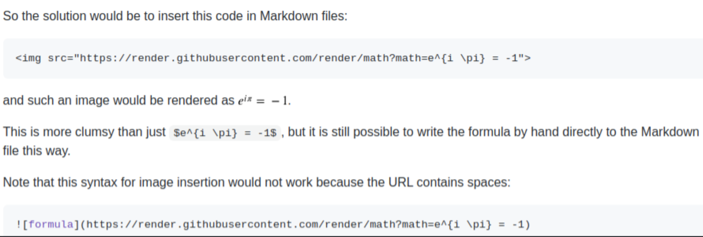
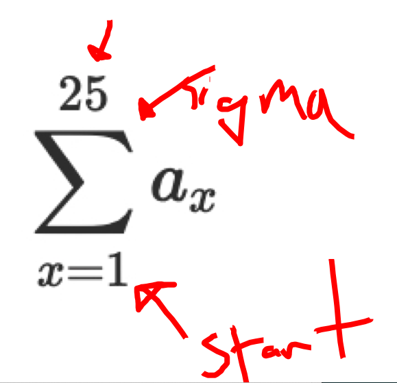

##### Rationale: 
* This repo involves a simple approach to notetaking for the Data Science Immersive at Galvanize.
* The contents are stubs and examples and there is no intent to make this more complete.
* A single markdown file is very searchable with CMD + F or CTRL + F
* If you need to, you can edit directly on GitHub

----------------------

# DSI Notes Topics
* [Markdown](#markdown) <-- this is an example of an internal reference link

----------------------


# Relevant Links
* [Visualizing `scipy.stats` distributions](https://stackoverflow.com/questions/37559470/what-do-all-the-distributions-available-in-scipy-stats-look-like)
* [MathJax basic tutorial and quick reference](https://math.meta.stackexchange.com/questions/5020/mathjax-basic-tutorial-and-quick-reference)


------------------------------
# <a name="markdown">Markdown</a>

## Anchors / internal reference links
In standard Markdown, place an anchor <a name="markdown"></a> where you want to link to and refer to it on the same page by [link text](#abcd).


## Images

```

```


------------------------------
# Bash Scripting
* bash profile location on OSX: `~./bash_profile`

## Basic Commands
* recursively delete a directory: `rm -rf <directoryname>`

### make a bash function

```bash
function gitadder() {
    git pull
    git add .
    git commit -m "Auto Updated: $(date '+%a %M:%H %h %d %Y')"
    git push    
}
```


----------------------
# Python 

## Comprehensions

```python
[num for num in range(100)]
```

## functions to remember

```python
def factorial(n):
    prod = 1
    for num in range(n+1):
        prod *= num
    return prod
```


-------------------
## Machine Learning Workflow

### Cross Validation
```python
# train/test split
```

### k-fold Cross Validation


### Bootstrap


------------------
# Sorting Algorithms

## Bubble Sort

```python
# hand coded algorithm
```

```python
# library-called bubble sort
```

----------------------------

# `matplotlib.pyplot` visualizations


----------------------------
# Derivations
* [Derivation of a Perceptron](https://github.com/clownfragment/delme_Master_DSI_Notes/blob/master/notebooks/derivation_of_a_perceptron.ipynb)

-------------------------
# LaTEX
* needs special syntax to render in GitHub, but will in VSCode preview:

$$
\sum_{x=1}^{25} a_x
$$

**Render LaTEX in GitHub**



------------------------
# Screenshotting

## Snappy app (Mac)
* easily screenshot regions of your screen, write on them, save, etc



## Ubuntu has its native screenshot app
* as well as Flameshot for taking screen snips with annotations.


